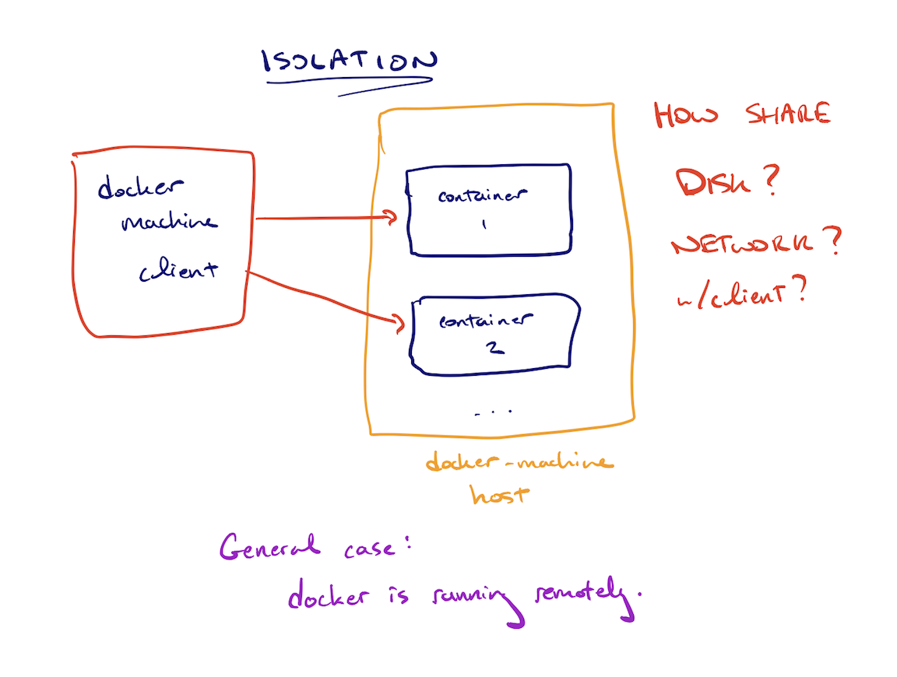
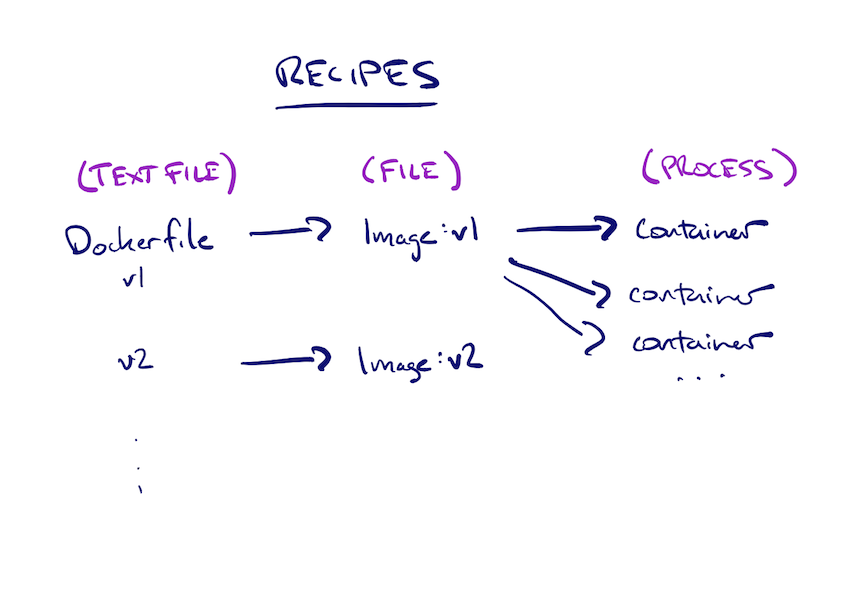

# A short workshop on Docker!

When: May 26, 2017, from noon - 1:30pm

Where: Data Science Initiative, UC Davis

Who: [C. Titus Brown](http://ivory.idyll.org/blog/), titus@idyll.org

(This is an updated and much shortened version of a
[2-day Docker workshop](https://github.com/ngs-docs/2016-bids-docker/blob/master/AGENDA.md)
that Luiz Irber and I ran at BIDS on UC Berkeley campus in January
2016.)

## Before the workshop

### INSTALL IN ADVANCE

If your laptop has > 20 GB free disk space and > than 4 GB of RAM,
please try to install Docker!

For Mac OS X: https://docs.docker.com/docker-for-mac/install/ -
install the Stable Channel one.

For Windows 10: https://docs.docker.com/docker-for-windows/install/ -
Stable Channel.

If you can't install it, please drop Titus Brown an e-mail with
"Docker tutorial - cannot install" in the subject line and he will set
you up with a remote machine for the workshop.

### DOWNLOAD IN ADVANCE

If you've gotten Docker installed and running, please try to execute the following three commands:

```
docker pull ubuntu:14.04
docker pull rocker/tidyverse
docker pull jupyter/notebook
```

This is network intensive so it'd be nice if you could do it in advance!

----

Titus will also spin up a few instances on Jetstream (see
[boot instructions(https://2017-ucsc-metagenomics.readthedocs.io/en/latest/jetstream/boot.html)) for people to use.  The only trick here is that you need to do give your account permission to run docker, e.g.

```
sudo usermod -aG docker titus
```

## Introducing Docker

Let's start with a demo --

`docker run -it -p 9001:8787 rocker/tidyverse`

This runs RStudio Web on local port 9001.  To connect to it on your
laptop go to `http://localhost:9001`; if you're running in a remote
machine (e.g. Jetstream), connect to `http://149.165.XXX.YYY:9001`.

The username is `rstudio` and the password is `rstudio`.

Try this bit of R code:

```
# Define 2 vectors
cars <- c(1, 3, 6, 4, 9)
trucks <- c(2, 5, 4, 5, 12)

# Graph cars using a y axis that ranges from 0 to 12
plot(cars, type="o", col="blue", ylim=c(0,12))

# Graph trucks with red dashed line and square points
lines(trucks, type="o", pch=22, lty=2, col="red")

# Create a title with a red, bold/italic font
title(main="Autos", col.main="red", font.main=4)
```

A few points to make --

* you had to install the image (that's what the `docker pull` command above
  did for you) but you didn't have to actually install any software other
  than docker -- RStudio is on the image already!
  
* This is running on your laptop computer (or wherever you are running the
  `docker` command), consuming that computer's resources.
  
* This is running in a completely isolated sandbox, with only network access.
  Any files or data you want have to be added or downloaded explicitly
  (We'll show you how to fix that later.)
  
* Some details (the username and the password; the port 8787 in the run command) are chosen by the people who create the image.  Other details (the port 9001 that we're using to connect to it) are specified by us as our way of connecting into the image. You can change the latter easily, but not the former!

Hit CTRL-C again and let's adjust the command line a bit --

```
docker run -it -p 9002:8787 -v $(pwd):/home/rstudio rocker/tidyverse
```

-- here we changed '9001' to '9002' and used the `-v` command to map our current working directory to `/home/rstudio` inside the container.  Now when we save files under `/home/rstudio` inside the container they will show up in our laptop (or jetstream machine's) directory.

To connect to this, change your previous URL from `http://localhost:9001` to
`http://localhost:9002`.

Hit CTRL-C to exit and then we'll take a step back.

### Docker and isolation

The above is Docker running a container locally, which is a special case that
gives you local access to disk and network.  It's super convenient for
running things in an isolated sandbox but with limited access to your local files.


More generally, you can have multiple containers running on multiple
machines, but then you don't generally have the nice disk sharing and
other stuff.  On the flip side, you can use more powerful machines
than your laptop, and you still get the benefits of isolation and
pre-installed software.



### Another quick demo

Just to show you that the commands are pretty similar no matter what
container you're running - let's run Jupyter Notebook!

```
docker run -it -p 9000:8888 -v $(pwd):/notebooks jupyter/notebook jupyter-notebook
```

This is running on port 9000 (the `-p 9000:8888`), and the
current working directory on your laptop `$(pwd)` is mapped to `/notebooks`
in the container.

One convenient thing here is the Jupyter Notebook console which gives
you an upload and download and terminal ability as well.

## Building your own images

Images are the on-disk artifacts that get turned into (running) containers.



You build an image by specifying a `Dockerfile` and then running
`docker build`; then this image is something you can turn into
multiple containers.

Here, each container is a new, isolated copy of the image.

----

One of the neat things about Docker is that you can build your own images!
Let's try it!

Make a new directory and create a `Dockerfile` in that directory:

```
mkdir -p my-hello
cd my-hello

cat > Dockerfile <<EOF
FROM ubuntu:14.04

USER root
COPY hello.sh /usr/local/bin
RUN chmod +x /usr/local/bin/hello.sh

RUN groupadd -r -g 1000 ubuntu && useradd -r -g ubuntu -u 1000 ubuntu
USER ubuntu

CMD ["/usr/local/bin/hello.sh"]
EOF
```

Also create a file `hello.sh`:

```
cat >hello.sh <<EOF
#! /bin/bash
echo hello, world
EOF
```

Now, build it --

```
docker build -t my-hello .
```

This command tells docker to build an image tagged with the name `my-hello`
from the instructions in the current directory.

Once it's built you can do
```
docker run -it my-hello
```

and you *should* see `hello, world`.

----

There are lots of "best practices" on writing Dockerfiles - see
[this page](https://docs.docker.com/engine/userguide/eng-image/dockerfile_best-practices/) in particular.

## Docker commands

Here a listing of some commands -- there's a bunch more, but these are the ones I mostly use.

Ones we've seen:

`docker run` - run a container from an image

`docker build` - construct an image from a Dockerfile

`docker pull` - copy a remote image for local use.

New ones:

`docker ps` - list running processes.

`docker rm -f` - kill container & remove working container.

`docker rmi` - remove downloaded image.

`docker push` - send a built image to a remote site (for later pull).

## Sharing images

You can upload your own images by creating an account on
[hub.docker.com](http://hub.docker.com) or [quay.io](http://quay.io).


You've already seen `pull` and `run`, which (respectively) download &
install a remote image and execute an image.  These rely on pre-built
images, built with `build`.

But building and updating your own images is annoying and slow.  The
neat thing is that if you provide a Dockerfile in a GitHub (or other
public version control) repository, you can link that repo to the
Docker hub or to Quay, and they will build it for you.  It's even all free
if you're using unrestrictied repositories and building open images!

## More advanced topics, in brief

* Using docker for workflows.  See [dockstore](http://dockstore.org) and
  [nextflowio](https://www.nextflow.io/) for two (of many!) projects in this
  area.
  
  My lab is planning on investing in this area, probably using
  dockstore; stop by and chat sometime!
  
* Using docker on our local campus HPCs:

  Currently it's impossible because you need admin privileges to run
  docker (and, wisely, HPCs don't give you that!), but you can ask the
  Farm and Cabernet folk to check out
  [Singularity](http://singularity.lbl.gov/), which is a
  docker-compatible system.

## Need help? Want to chat?

We run a weekly open office hours over on the Health Sciences campus
(this quarter: Wed 3:15-5:15 in the Bennett Room / Center for
Companion Animal Health) and we would be happy to chat with you there
about all your Docker questions, problems, and goals!  If you have a
conflict, please contact Titus to set up another time to meet.
